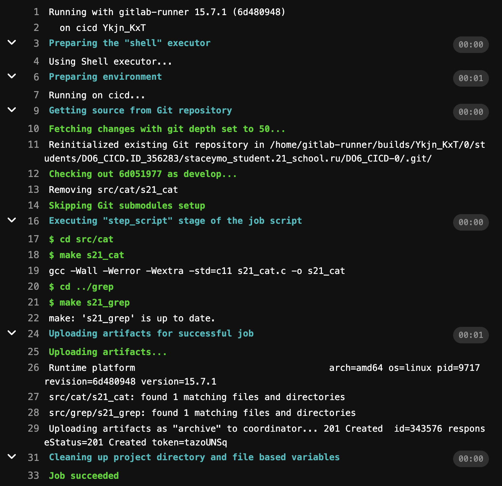
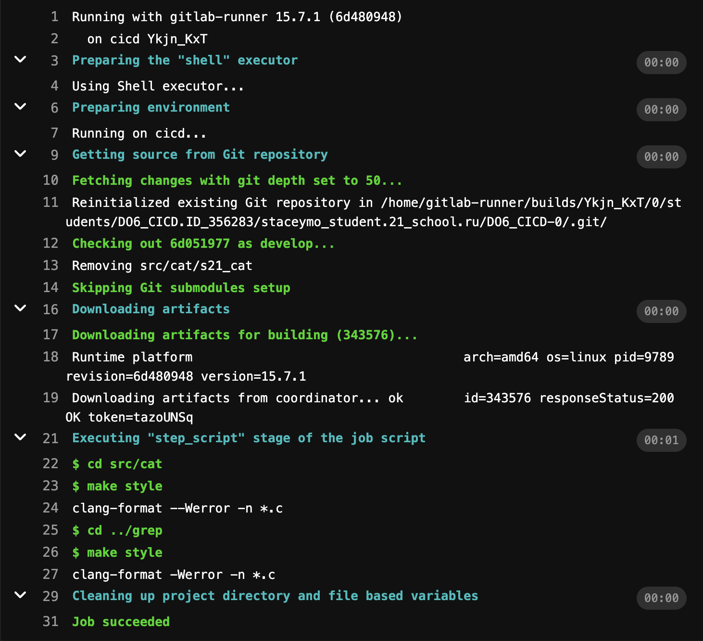
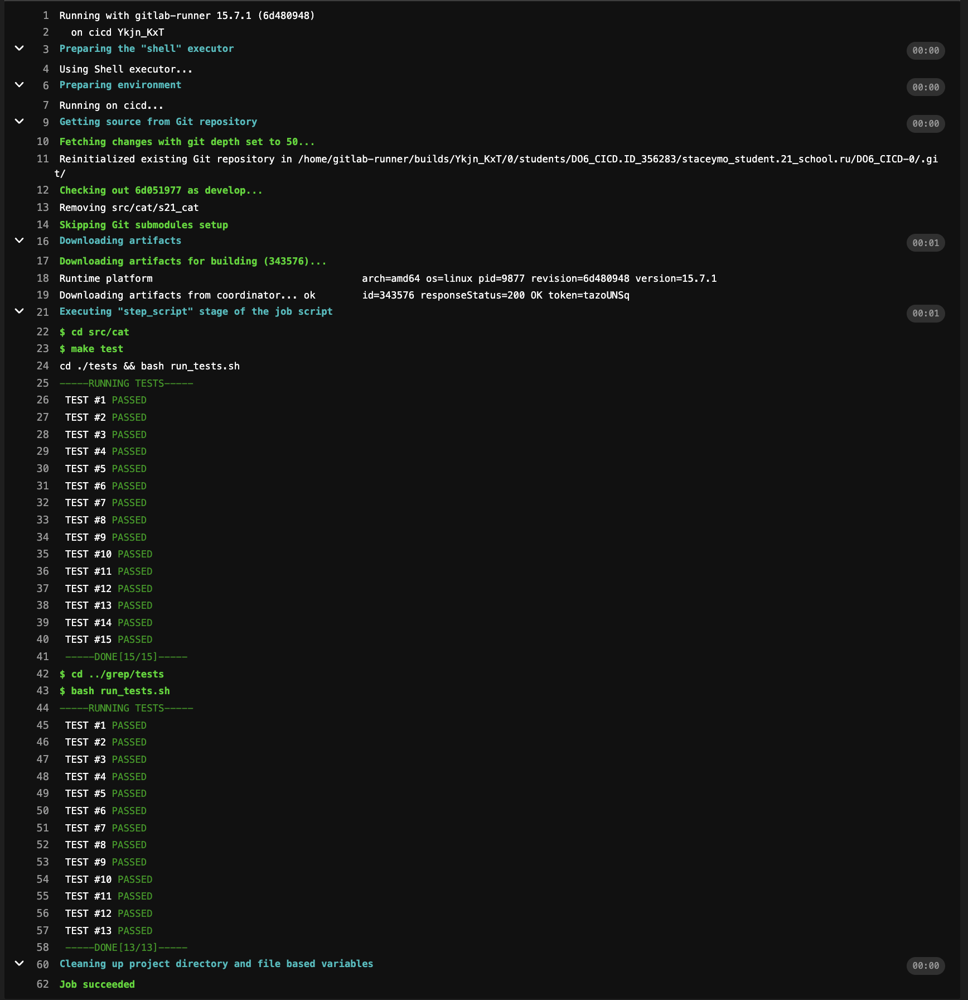
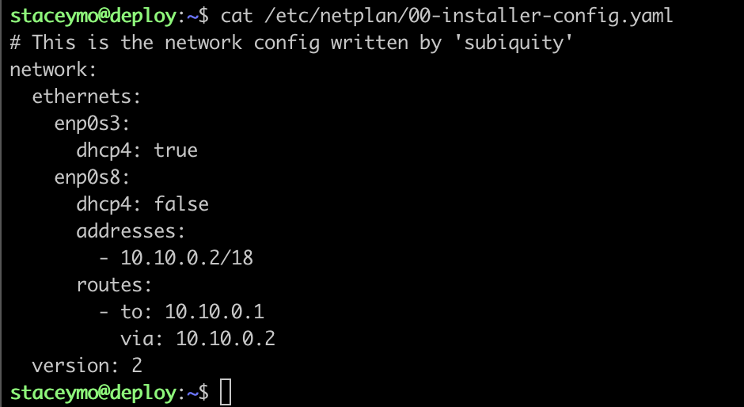
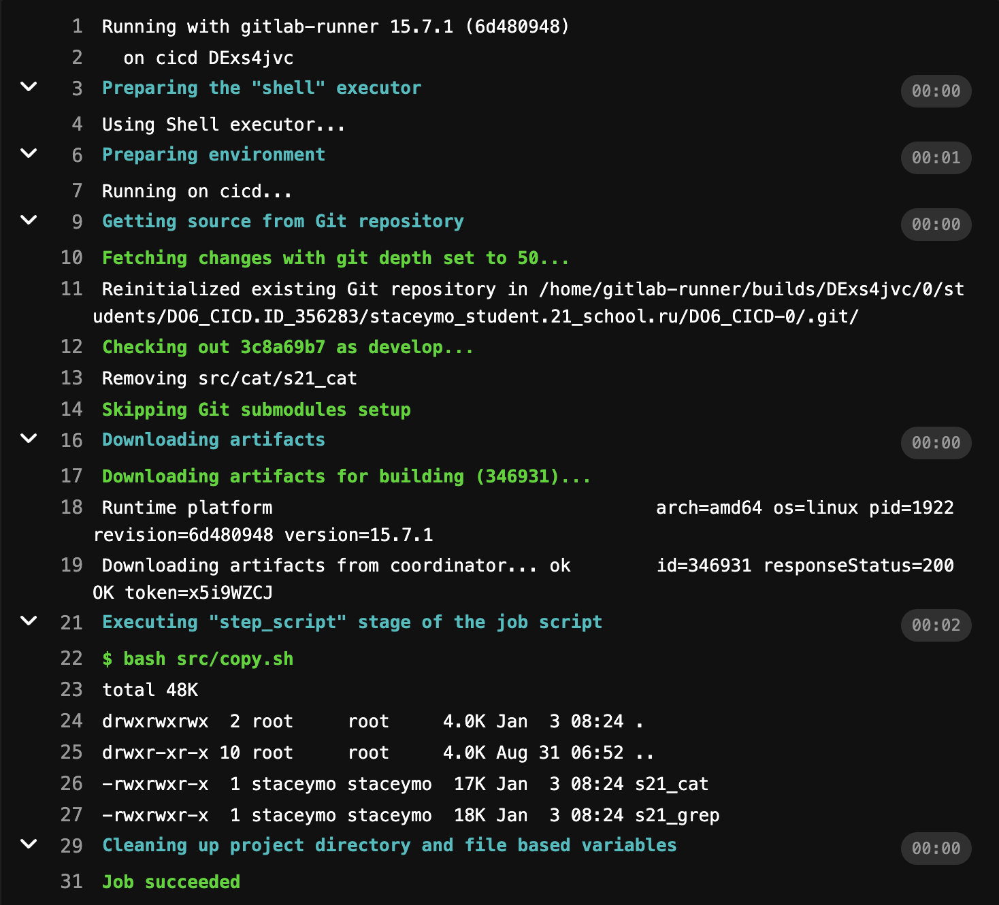
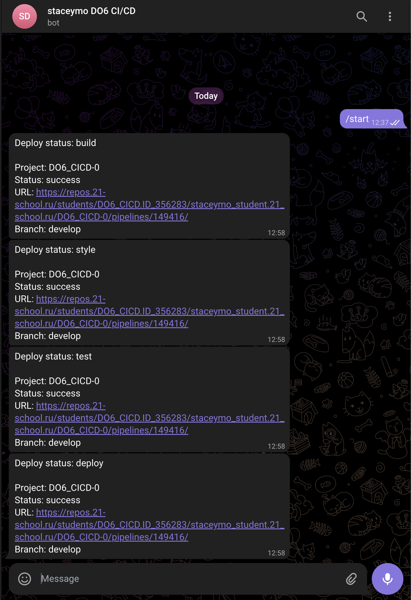

# CICD Project
## Part 1. Installing the gitlab-runner LMFAO

Install gitlab-runner 
> sudo curl -L --output /usr/local/bin/gitlab-runner "https://gitlab-runner-downloads.s3.amazonaws.com/latest/binaries/gitlab-runner-linux-amd64" </br>

> sudo chmod +x /usr/local/bin/gitlab-runner </br>

> sudo useradd --comment 'GitLab Runner' --create-home gitlab-runner --shell /bin/bash </br>

> sudo gitlab-runner install --user=gitlab-runner --working-directory=/home/gitlab-runner </br>

> sudo gitlab-runner start </br>

> sudo systemctl enable --now gitlab-runner </br>

Register gitlab-runner with

> sudo gitlab-runner register
```
    URL: https://repos.21-school.ru
    token: <your_token_from_the_platform>
    -
    tags: build,style,test,deploy,notify
    -
    executor: shell
```
> sudo gitlab-runner verify </br>
> sudo gitlab-runner run
> sudo rm /home/gitlab-runner/.bash_logout 

Check status of the gitlab-runner with
> service gitlab-runner status

## Part 2. Build test

Create .gitlab-ci.yml
> nano .gitlab-ci.yml

.gitlab-ci.yml:
```
building:
  stage: build
  tags: 
    - build
  script:
    - cd src/cat
    - make s21_cat
    - cd ../grep
    - make s21_grep
  artifacts:
    paths:
      - src/cat/s21_cat
      - src/grep/s21_grep
    expire_in: 30 days
```
result: 



## Part 3. Style test

.gitlab-ci.yml:
```
codestyle:
  stage: style
  tags: 
    - style
  script:
    - cd ${CI_PROJECT_DIR}/src
    - make style
```

result:



## Part 4. Testing code 

.gitlab-ci.yml:
```
test_code:
  stage: test
  tags:
    - test
  script:
    - cd ${CI_PROJECT_DIR}/src
    - make test 
  when: on_success
```

result: 



## Part 5. Deploying

Create new virtual machine 

Link the machines

netplan yaml for the 1st one with the runner:


netplan yaml for the 2nd one:



write script that copies artifacts from gitlab-runner builds (see src/copy.sh)

allow 1st machine to use ssh command without the 2nd machine's password:

> sudo su - gitlab-runner </br>

> ssh-keygen -t rsa -b 2048 </br>

> ssh-copy-id <username>@<ip_address> (ip and username of the 2nd machine)

give all the rights on the 2nd machines's folder where we copy our artifacts:

> sudo chmod -R 777 /usr/local/bin/

.gitlab_ci.yml:
```
deploy:
  stage: deploy
  tags:
    - deploy
  script:
    - bash src/copy.sh
  when: manual
```
<sub> manual allows to choose whether you want to go through deploy stage or not </sub>

result: 



## Part 6. Notifications

create telegram bot using @FatherBot

get the bot's token and use it in our script from materials/notification.md (see src/notify.sh)

add telegram profile id and job_status ($CI_JOB_STATUS) to the script

add this to every job in .gitlab-ci.yml:
```
  after_script:
    - sh src/notify.sh "job_name"
```

result:



## Thanks to these links

* https://repos.21-school.ru/help/ci/quick_start/index.md
* https://docs.gitlab.com/runner/
* https://www.dmosk.ru/miniinstruktions.php?mini=gitlab-runner-web#runner-register
* https://repos.21-school.ru/help/ci/yaml/README
* https://docs.gitlab.com/runner/install/linux-manually.html